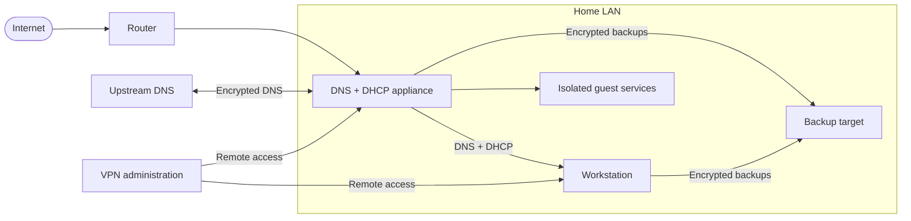

# nix-config

[](https://nixos.org)
[](https://github.com/knirski/nix-config/actions/workflows/ci.yml)
[](https://flake.parts)

A multi-host NixOS flake for a dependable LAN appliance and a daily-driver
workstation—built as a practical guide to modern, readable Nix.



## Hosts

| Host | Role | Channel | Status |
| --- | --- | --- | --- |
| **Soyo** | DNS and DHCP appliance | NixOS 26.05 | Production; Secure Boot enabled |
| **zbook** | Desktop, gaming and backup client | nixpkgs unstable | Production; Secure Boot enabled |

The diagram intentionally shows roles and trust flows, not a home-network
inventory. See the [public repository data policy](docs/security/public-repository.md).

## Design principles

- **Keep the critical path small.** DNS and DHCP are Soyo's only critical
  roles; every guest service is opt-in and resource-isolated.
- **Make state explicit.** Each boot restores a blank Btrfs root; only the
  reviewed `/persist` inventory survives.
- **Keep hosts thin.** Reusable behavior lives in toggleable NixOS and Home
  Manager aspects; host directories contain hardware and policy data.
- **Encrypt and recover.** agenix-rekey protects secrets, TPM unlock has a
  passphrase fallback, and remote recovery paths remain documented.
- **Test the contracts.** Evaluation checks, NixOS VMs, full system builds and
  operator drills cover different layers of confidence.

The [canonical appliance design](docs/superpowers/specs/soyo-dns-dhcp-appliance.md)
records the decisions and trade-offs behind these rules.

## Quick start

You need Nix with the `nix-command` and `flakes` experimental features.

```bash
git clone https://github.com/knirski/nix-config.git
cd nix-config
nix develop

# Safe, local inspection and verification
just                  # list available recipes
just lint             # static checks and secret scanning
just build zbook      # build without activating or deploying
nix flake check path:. --keep-going
```

Deployments, secret rekeying, disk installation and recovery are deliberately
not quick-start commands. Read the matching runbook and review the target first.

## Find your path

- **Learn:** follow the [guided learning path](docs/learning/README.md), then
  explore the [design journey](docs/learning/design-journey.md) and
  [verification layers](docs/learning/verification-layers.md).
- **Operate:** use the reviewed runbooks for
  [installation](docs/install-soyo.md),
  [updates and rollback](docs/update-and-rollback.md),
  [backup and restore](docs/backup-and-restore.md),
  [recovery](docs/recovery.md), and [secrets](docs/secrets.md).
- **Understand:** begin with the [canonical design](docs/superpowers/specs/soyo-dns-dhcp-appliance.md),
  [testing model](docs/testing.md), and
  [public-data policy](docs/security/public-repository.md).
- **Contribute:** read [AGENTS.md](AGENTS.md) before editing. It contains the
  hard invariants, repository boundaries and required verification workflow.

The complete, progressively organized index is at **[docs/README.md](docs/README.md)**.

## Architecture in one minute

`flake.nix` delegates to flake-parts and `import-tree`. Eligible files below
`modules/` are discovered automatically; `_`-prefixed directories are excluded.
Discovery does not enable a feature: host assemblers explicitly select aspects
such as `base`, `persistence`, `blocky`, `dhcp`, `sway` and `nvidia`.

```text
flake.nix
├── modules/nixos/   reusable NixOS aspects
├── modules/home/    reusable Home Manager aspects
├── modules/parts/   host assemblers, checks and flake outputs
├── hosts/           hardware and host-specific policy
├── lib/             plain reusable Nix helpers
└── tests/           named fixtures and executable behavior tests
```

Start with `modules/parts/soyo.nix` or `modules/parts/zbook.nix` to see exactly
which aspects build each host.

## Scope

This repository is configuration for specific hardware, not a drop-in NixOS
distribution. Its modules, tests and explanations are intended to be reusable;
disk identifiers, network policy and recovery procedures must be adapted before
use elsewhere.

Shared as a learning project; contributions should favor clarity, declarative
recovery and evidence over cleverness.
