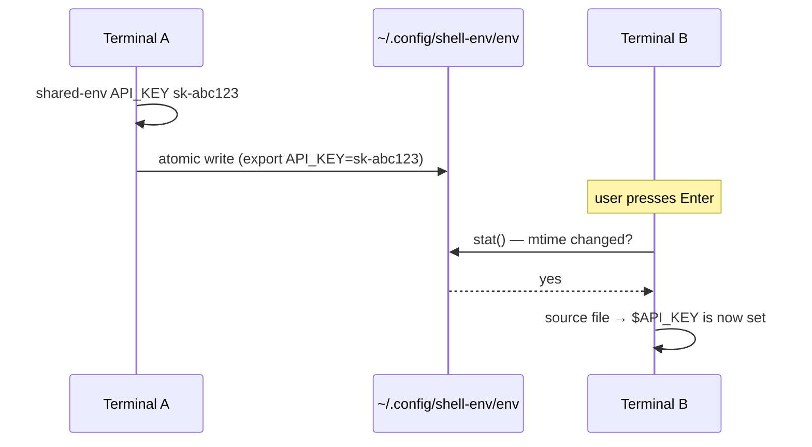

# shared-env: broadcast environment variables to all terminals

## The problem

You set an environment variable in one terminal:

```zsh
export API_KEY="sk-abc123"
```

Then you switch to another terminal you already had open — and `$API_KEY` is
empty. Environment variables are process-local; they're inherited by child
processes but never shared between siblings.

## What shared-env does

`shared-env` lets you set a variable in **one terminal** and have it
automatically appear in **all other open terminals** on their next prompt.

```zsh
# In terminal A:
shared-env API_KEY "sk-abc123"

# Press Enter in terminal B — $API_KEY is now set.
```

It also works for future terminals (new windows, new tmux panes) because the
data lives in a file on disk.

## How it works

Two pieces work together:

### 1. The shared store (`~/.config/shell-env/env`)

This is a plain text file with `export` lines:

```sh
export EDITOR=nvim
export API_KEY='sk-abc123'
```

When you run `shared-env NAME VALUE`, the whole file is **rewritten
atomically** (write to `.tmp`, then `mv`). This means:

- No duplicates — `shared-env FOO bar` run twice still produces one line.
- No corruption — concurrent writes from two terminals don't interleave.
- Removals work — `shared-env-rm FOO` filters the line out.

### 2. The precmd hook

Every zsh runs a function **just before showing its prompt** (`precmd`).
The hook checks if the shared store file's modification time (`mtime`)
changed since the last check. If it did, it `source`s the file, importing
any new/changed/removed variables.

The mtime check is cheap — a `stat()` system call that returns immediately
when nothing changed. The actual `source` (which reads and parses the file)
only happens on the rare prompt where you or another terminal wrote to the
store.



## Usage

```zsh
# Set a variable
shared-env EDITOR "nvim"
shared-env MY_TOKEN "ghp_xxxxxxxxxxxx"

# Set a variable with special characters (zsh handles quoting)
shared-env SECRET "abc!@# some dollar sign"

# Remove a variable
shared-env-rm MY_TOKEN

# Check current value (just like any env var)
echo $EDITOR

# Override the store path (default: ~/.config/shell-env/env)
export SHARED_ENV_FILE="$HOME/.config/my-custom-env"
```

## What this is good for

- **API keys and tokens** you just generated and want in all terminals now.
- **Temporary overrides** like `shared-env DEBUG 1` while debugging.
- **Tool configuration** like `shared-env EDITOR nvim` after changing your mind.
- **CI / ad-hoc credentials** fetched from a vault and broadcast to open shells.

## What this is NOT good for

- **Application config that never changes.** Put those in `~/.zshenv`
  directly — why pay the cost of a file watch when the value is static?

- **Secrets that should persist across reboots.** The shared store is a
  plain-text file in your home directory. Use a proper secret manager for
  long-lived secrets.

- **Cross-shell sync.** The helpers are zsh-only (they rely on `add-zsh-hook`,
  `zsh/stat`, `${(q)}` quoting). For bash or fish, you'd need a different
  mechanism.

## File format

The shared store is a valid shell script sourced by zsh. Each line is:

```sh
export NAME='value'
```

Values are quoted with zsh's `${(q)}` flag, which produces single-quote
formatting that handles spaces, special characters, and newlines safely.

You can edit the file directly with any text editor — the precmd hook will
pick up changes on the next prompt.  However, using `shared-env` / `shared-env-rm`
is preferred because they write atomically (no partial writes).

## Implementation

The source lives in two places:

| File | Purpose |
|------|---------|
| `lib/shared-env.zsh` | The zsh helpers (`shared-env`, `shared-env-rm`, precmd hook) |
| `modules/home/base.nix` | home-manager module that sources it into `~/.zshrc` |

The Nix module reads the `.zsh` file with `builtins.readFile` and embeds it
into the generated `.zshrc` at build time.  Tests are in `tests/shell/shared-env.bats`.

## Running the tests

```bash
# Via Bats directly (needs zsh and bats installed):
bats tests/shell/shared-env.bats

# Via the flake check suite (includes boundary checks):
nix flake check
```
