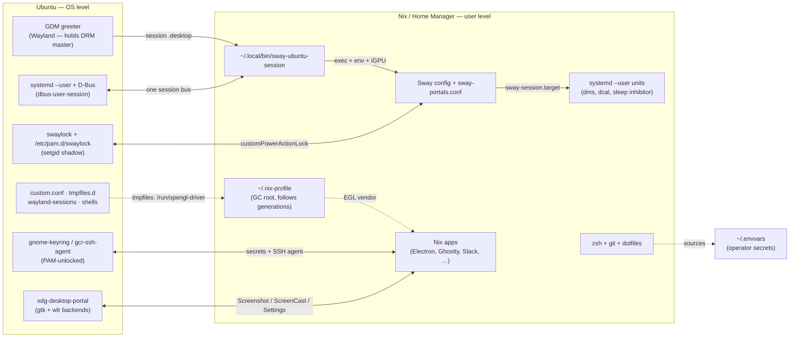

# The Ubuntu ↔ Nix surface

The `ubuntu` output of this flake is a **standalone Home Manager** configuration:
Ubuntu owns everything below the `knirski` user, Home Manager owns the user
environment, and nothing in between is a NixOS system. That makes the boundary
— the *surface* — the most important thing to understand about this host: every
piece of it is either a Nix-managed file, an Ubuntu-owned file, or a contract
one side keeps with the other.

This document is the map of that surface. The runbooks are:

- [`docs/install-ubuntu.md`](install-ubuntu.md) — first install, step by step.
- [`docs/ubuntu-adaptations.md`](ubuntu-adaptations.md) — the Ubuntu-level setup
  checklist (apt packages, GDM, `/run/opengl-driver`, session entry).
- [`docs/ubuntu-upgrade.md`](ubuntu-upgrade.md) — the 24.04 → 26.04 LTS upgrade
  runbook, which is mostly "verify the surface after Ubuntu changes its half".

## The split at a glance

| Layer | Owner | Examples |
| --- | --- | --- |
| Kernel, drivers, firmware | Ubuntu | i915, Mesa, `systemd`, GDM, logind, `nix-daemon` as a system service |
| System packages | Ubuntu (apt) | `dbus-user-session`, `xdg-desktop-portal{-gtk,-wlr}`, `swaylock`, `tailscale` |
| System services Nix programs consume | Ubuntu | `gnome-keyring`/`gcr-ssh-agent`, the PAM stack, D-Bus session bus |
| User environment | Nix (Home Manager) | packages, dotfiles, zsh, git, Sway config, DMS/dcal/dsearch user units, the session launcher |
| Machine-local, neither | Operator | `~/.envvars`, the `hms-ubuntu` wrapper, removed snaps, `gh auth` |

Two consequences follow from the split and are worth stating once:

- **Ubuntu never reads the Nix store.** Everything Ubuntu launches or loads
  must be reachable through stable symlinks (`~/.nix-profile`, `~/.local/bin`,
  `/run/opengl-driver`). Raw `/nix/store/<hash>-…` paths break on the next
  garbage collection or version bump.
- **Home Manager never writes a system file.** Everything Nix needs from the OS
  is installed by apt or written by the operator, and every one of those
  Ubuntu-owned files is listed below.

## Map



## Crossing points

### 1. Stable paths — the "never point into the store" contract

Every external reference to the Nix world goes through a stable symlink that is
a GC root and follows generations:

| Path | What it is | Who references it |
| --- | --- | --- |
| `~/.nix-profile` | Home Manager's default user profile | GDM session entry (`Exec`), `/etc/shells` + `/etc/passwd` (optional zsh login shell), `/run/opengl-driver` tmpfiles rule, launcher `PATH`/`XDG_DATA_DIRS` |
| `/nix/var/nix/profiles/default` | Determinate-installer system profile (the `nix` binaries) | launcher `PATH` |
| `~/.local/bin/sway-ubuntu-session` | HM-generated session launcher | GDM session entry, virtual-console logins |

Contract: these are the only paths Ubuntu may hand to Nix software. A store
path in `/etc/shells` or in the `.desktop` file becomes dangling the moment the
old derivation is garbage-collected.

### 2. Session environment — what the launcher exports

GDM execs `~/.local/bin/sway-ubuntu-session` directly, so no login shell ever
sources `~/.profile` or `hm-session-vars.sh`. The launcher (generated in
`modules/parts/ubuntu.nix`) is therefore the contract that puts the Nix world
onto the session:

| Variable or concern | Value | Needed because |
| --- | --- | --- |
| `PATH` | profile first, then `/nix/var/nix/profiles/default`, then Ubuntu's | Sway runs keybindings through `sh -c`; without it `ghostty: not found` |
| `XDG_DATA_DIRS` | profile first, then system dirs | every `.desktop` file HM installs must be visible to the launcher and mime lookups |
| `SSH_AUTH_SOCK` | `$XDG_RUNTIME_DIR/gcr/ssh` | deliberately picks Ubuntu's gcr agent, not gpg-agent's emulation (see item 4) |
| `DBUS_SESSION_BUS_ADDRESS` | probed socket at `$XDG_RUNTIME_DIR/bus`; `dbus-run-session` fallback only when absent | one session bus shared with `systemd --user`; a private bus breaks `dbus-update-activation-environment --systemd` and notification/MPRIS/tray cross-talk |
| `WLR_DRM_DEVICES` | iGPU resolved from `/dev/dri/by-path/pci-0000:00:02.0-card` | `cardN` indices are not stable across kernel upgrades; unset when the node is missing so Sway auto-discovers |
| `XDG_CURRENT_DESKTOP=sway`, `XDG_SESSION_TYPE=wayland`, `MOZ_ENABLE_WAYLAND`, `NIXOS_OZONE_WL`, `QT_QPA_PLATFORM`, … | set by the launcher | the standalone equivalent of NixOS's `sessionVariables` in `modules/nixos/sway.nix` |
| Keyring backend | `--password-store=gnome-libsecret` baked into Electron binaries by an overlay in `modules/parts/ubuntu.nix` | environmental hints do not reach every launch path (launcher-spawned, systemd-started, D-Bus-activated); a command-line flag does. Apps added later that store secrets must join the overlay |

`dms` and `dcal` are started by systemd, not Sway, so they inherit nothing the
launcher exports: `modules/parts/ubuntu.nix` hands their units the same
`PATH`/`XDG_DATA_DIRS` via `Service.Environment` (NixOS hosts must not get
this — they inherit a correct PATH from `pam_env`).

### 3.1 Cloudflare WARP and browser handoff

Cloudflare WARP is Ubuntu-owned. The official package provides
`/usr/bin/warp-cli`, `/bin/warp-taskbar`, and the vendor
`warp-taskbar.service`; Home Manager does not install or replace the WARP GUI.
Home Manager owns the browser side of the boundary:

- `~/.config/mimeapps.list` selects `firefox.desktop` for HTTP(S).
- The user-local `firefox.desktop` is generated with the stable
  `~/.nix-profile/bin/firefox` path. This matters because the vendor systemd
  service does not inherit the interactive shell's Nix `PATH`.
- The stale `firefox-nvidia.desktop` and `chrome-nvidia.desktop` handlers are
  removed, and the local desktop MIME cache is regenerated during activation.
  A stale cache or NVIDIA handler can make WARP launch a different browser
  even when `mimeapps.list` says Firefox.
- The WARP service receives `BROWSER=xdg-open`, `PATH`, and `XDG_DATA_DIRS`
  through `systemd.user.sessionVariables`, so its GTK/GIO browser lookup sees
  the Home Manager profile.

To force re-authentication without the GUI button, run:

```bash
warp-cli debug access-reauth --no-paginate
```

If the GUI or CLI reports that a browser should have opened, check the handler
and service state before changing associations:

```bash
gio mime x-scheme-handler/https
systemctl --user status warp-taskbar.service
warp-cli status
```

Apply the durable configuration with `just deploy ubuntu`; restart the vendor
GUI after deployment with `systemctl --user restart warp-taskbar.service`.

### 3. Ubuntu-owned system files that exist to serve Nix

These live outside every Home Manager generation. `scripts/bootstrap-ubuntu-system.sh`
(`just bootstrap-ubuntu-system`) applies and re-verifies them idempotently:

| File | Purpose | What breaks when missing |
| --- | --- | --- |
| `/etc/gdm3/custom.conf` | `WaylandEnable=false` commented out, so the greeter runs Wayland and lets Sway take DRM master | Sway starts but never displays: `Atomic commit failed: Device or resource busy` on every connector |
| `/etc/tmpfiles.d/nix-opengl-driver.conf` | tmpfs rule: `/run/opengl-driver → /home/knirski/.nix-profile`, giving every Nix GL process a working EGL vendor (Nixpkgs' libglvnd searches this path first; Ubuntu's libglvnd has no such path, so Ubuntu binaries never see it) | every Nix GL program fails with `Failed to create EGL display` |
| `/usr/share/wayland-sessions/sway-nix.desktop` | GDM session entry, `Exec=/home/knirski/.local/bin/sway-ubuntu-session` | Sway is absent from the GDM session list |
| `/etc/shells` + `/etc/passwd` (optional) | registers `~/.nix-profile/bin/zsh` so `chsh` accepts it as login shell | `chsh` refuses; zsh config still works from any interactive shell |

Apt packages Home Manager *depends on* (installed by the operator once; they
are never Nix outputs):

| apt package | Consumed by |
| --- | --- |
| `dbus-user-session` | the session bus at `$XDG_RUNTIME_DIR/bus` (item 4) |
| `xdg-desktop-portal` + `-gtk` + `-wlr` | portal backends; the *selection* is Home Manager's (`~/.config/xdg-desktop-portal/sway-portals.conf`: `default=gtk`, `Screenshot`/`ScreenCast=wlr`) |
| `swaylock` | the only working lock path on this machine (item 4); ships `/etc/pam.d/swaylock` |
| GPU driver packages (Intel Mesa) | Ubuntu's own programs only; Nix programs get GL via `/run/opengl-driver` |
| `tailscale` (optional) | operator-installed; the HM SSH aspect only configures client behavior |

### 4. Runtime services crossing the boundary

- **D-Bus.** Ubuntu's `dbus-user-session` puts a bus on `$XDG_RUNTIME_DIR/bus`,
  where `systemd --user` also listens. The launcher joins that bus (and only
  starts a private one for a bare console login). Contract: one bus per login,
  shared by Sway clients, HM user units and D-Bus-activated services.
- **Keyring and SSH agent.** Ubuntu's `gnome-keyring`/`gcr-ssh-agent` are
  unlocked by GDM's PAM at login and hold all five SSH keys. The launcher names
  the gcr socket explicitly — historically the socket was inherited from an
  X11 leftover (`/etc/X11/Xsession.d/90gpg-agent`) and pointed at gpg-agent,
  which held only some keys. Git *signing* still goes to gpg-agent: gnome-keyring
  answers `agent refused operation` to `ssh-keygen -Y sign`, so
  `gitSshSign` (in `modules/parts/ubuntu.nix`) overrides the socket for the
  signing invocation only.
- **systemd --user.** Ubuntu's user manager runs HM's user units (`dms`,
  `dcal`, the media-sleep inhibitor). They gate on `ConditionEnvironment`; Sway
  additionally starts `sway-session.target` on every run so a crashed session
  attempt cannot permanently mark them skipped.
- **PAM — the lock screen.** A Nix-built PAM stack cannot authenticate on this
  machine: `pam_unix` needs the setgid `unix_chkpwd` helper, which cannot exist
  in the Nix store, and Nix's PAM closure lacks `libselinux`/`libcrypt` to dlopen
  Ubuntu's modules. So the lock path is **delegated to Ubuntu's `swaylock`**
  (setgid helper, ships its own `/etc/pam.d/swaylock`) via DMS's
  `customPowerActionLock` — idle timeout, `Ctrl+Mod+l` and logind lock alike.
- **DRM master.** The GDM greeter must run Wayland (item 3), or its Xorg server
  holds DRM master and Sway cannot page-flip. This machine drives every
  connector from the Intel iGPU (`pci-0000:00:02.0`); the discrete RTX A1000
  has no display outputs and is not used.

### 5. State and data

| Path | Owner | Notes |
| --- | --- | --- |
| `~/.local/state/home-manager` | Nix | generations, GC roots; survives OS upgrades untouched |
| `~/.config`, `~/.ssh`, browser profiles, `~/.local/share` | Ubuntu filesystem, Nix-managed references | mutable state written by HM-managed apps; DMS's `session.json` and wallpaper use the stable `~/.local/share/wallpapers/hive-grid.png` symlink because the shell rewrites that file itself |
| `~/.envvars` | Operator | machine-local secrets, sourced by the shared zsh config; never enters the Nix store, never committed |
| Secrets in the flake | none for ubuntu | no `age.rekey`, no `age.secrets` — nothing in `modules/parts/ubuntu.nix` reads an ubuntu secret |

## Failure modes

Symptom → surface point → fix:

| Symptom | Surface point | Fix |
| --- | --- | --- |
| Sway missing from the GDM session list | `/usr/share/wayland-sessions/sway-nix.desktop` | `just bootstrap-ubuntu-system` |
| Sway starts but never displays; `Atomic commit failed: Device or resource busy` | `/etc/gdm3/custom.conf` (`WaylandEnable=false`) | `just bootstrap-ubuntu-system`, restart `gdm3` |
| Every Nix GL app: `Failed to create EGL display` | `/run/opengl-driver` tmpfiles rule | `just bootstrap-ubuntu-system` |
| Sway keybindings: `ghostty: not found` | launcher `PATH` | `just deploy ubuntu` (launcher is a Home Manager file) |
| `dms`/`dcal` never start (`ConditionEnvironment` skipped) | unit environment / `sway-session.target` wiring | `modules/home/sway.nix` |
| Lock screen rejects the correct password (`pam_unix(dankshell:auth): authentication failure`) | Nix PAM vs Ubuntu `swaylock` | HM's `customPowerActionLock` + apt `swaylock` |
| Electron apps store secrets in plaintext (`Detected change in safeStorage backend`) | `--password-store` overlay | add the app to `chromiumSecretStoreOverlay` in `modules/parts/ubuntu.nix` |
| Git signing: `agent refused operation` | gcr vs gpg-agent split | `gitSshSign` in `modules/parts/ubuntu.nix` |
| GTK4 apps hang; portal answers `Failed to ReadAll() from Settings implementation: Timeout was reached` | portal backend selection | `~/.config/xdg-desktop-portal/sway-portals.conf` (HM) + apt portal packages |
| WARP re-authentication opens nothing or selects the wrong browser | Ubuntu WARP GUI + user MIME cache + systemd service environment | `just deploy ubuntu`; verify plain `firefox.desktop`, then restart `warp-taskbar.service` |
| Snap Electron apps never map a window under Sway | snap sandbox GL | operator: `sudo snap remove slack code intellij-idea spotify bitwarden` (one-time) |

## What guarantees the surface

- **Nix side** — CI builds `homeConfigurations.ubuntu.activationPackage`
  (`build-ubuntu` job) and `checks.ubuntu-desktop-invariants` verifies the
  built closure contains the expected packages and that the `activate` script
  still supports the stable `~/.nix-profile` zsh path the `chsh` instructions
  depend on.
- **Ubuntu side** — `just bootstrap-ubuntu-system` applies and re-verifies the
  three system files; it is deliberately idempotent and safe to run at any time.
- **Whole host** — `just healthcheck ubuntu` (role `standalone-hm`) probes Nix
  installation, the Home Manager profile, SSH config and `.zshrc`.
- **Manual boundary** — session-level behavior (GL, keyring, portals, lock,
  agent) is only verifiable in a live Sway session; see the upgrade runbook's
  post-upgrade checklist for the concrete list.

## Invariants

1. External references use profile symlinks, never `/nix/store` paths.
2. One D-Bus session bus per login, shared with `systemd --user`.
3. `/run/opengl-driver` points at `~/.nix-profile` (a GC root), not a store path.
4. Portal *selection* is Home Manager's; portal *packages* are Ubuntu's.
5. Secrets never enter the Nix store (`~/.envvars`) or the repository (no
   agenix on ubuntu).
6. The lock path is always Ubuntu's `swaylock`; Nix-built locks cannot
   authenticate here.
